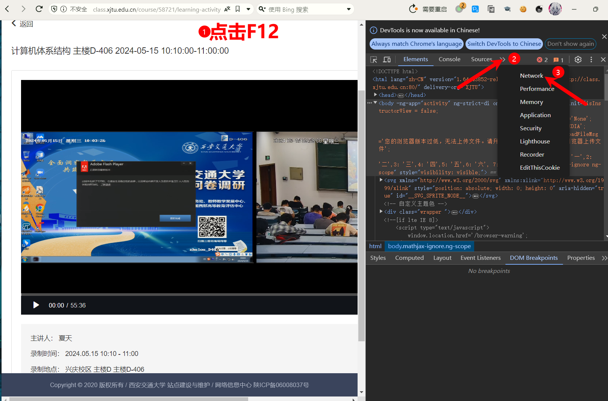
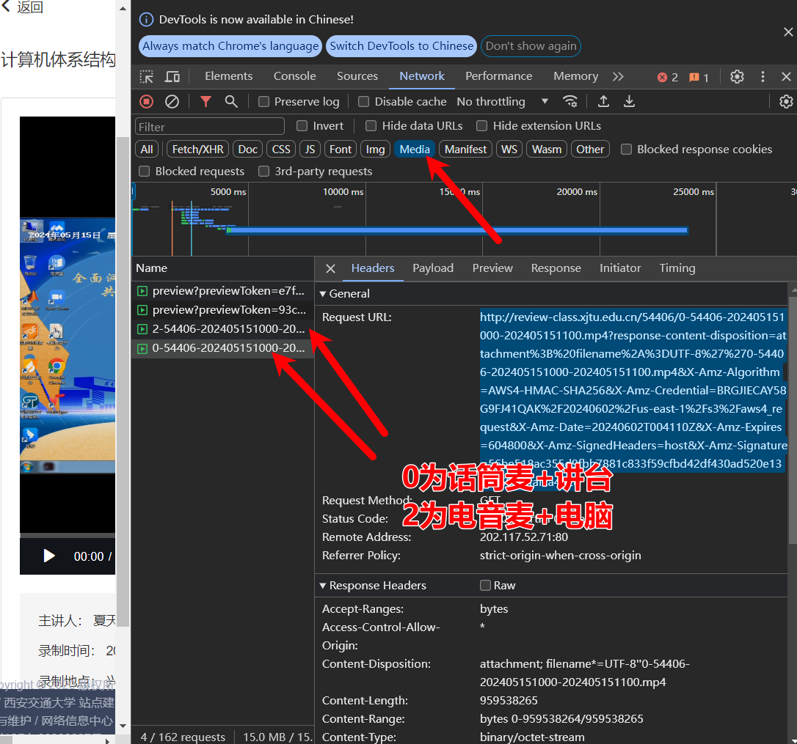

# 生活指南

Written by axi.

## 前言

初来交大，你可能来自于天南海北，但是注定在这里度过四年的生活<del>（假如你没有发生意外）</del>，如何在交大生活，如何掌握一些奇妙的小技巧，毫无疑问是至关重要的。

生活指南中的内容主要包括以下：

- 紧急事务处理：在遇到了一些紧急事项的时候，如何很好的解决。
- 学生日常捷径：生活中有很多的琐事，如何走捷径。
- 自我提升方法：如何自我提升，学习/技能/运动。
- 不为人知的内容：一些在交大你或许需要的小技巧。

## 学生事务

### 补办学生卡

在生活中，假如因为保管不妥当，很可能出现学生卡丢失的情况，这时候补办学生卡就成为必须的事情了。通常来说，在主楼E（主E）二楼以及食堂中均存在补办学生卡的机器，在其上可以办理学生卡，一般来说学生卡补办收取10元，需要输入学生卡密码（默认为888888）。

学生卡在补办之后到正式具备效力，并非立即的，但是在这段期间，使用手机软件“移动交通大学”可以让你得到学生卡使用的绝大多数功能。其中存在付款码用于在刷卡机上进行付款，以及认证码可以用来进入门禁，唯一无法进行的是洗澡的刷卡。

## 学习相关

### 考勤修改

<u>**本部分内容仅代表一种迫不得已的情况下可能可以提供选择的方法，本教程并不推荐读者说谎或者因此修改考勤，也并不支持这样的导向，但是本模块依然有存在的必要，对于内向且焦虑的读者来说，本教程很可能能帮助缓解心理的压力。**</u>

完蛋了，一睁开眼睛发现已经迟到，舍友没有帮你打卡，或者你羞于启齿，现在坏事了。如何优雅的修改考勤，怎么拯救自己的平时分，借口？技巧？还是什么别的，本模块试图教会你。

来不及上课了，上课铃响了？不要着急，事实上在上课后的五分钟之内进行打卡都是正常的考勤，但是假如说过了五分钟，或许你不应该打卡，把迟到改成正常可能会比把缺勤改成正常还要困难。一般来说，正常的迟到缺勤，一个通用的借口可以解决这一问题，选择课间在别人出教室时进入教室，避免携带过大的包，之后表明“刚才检查考勤系统，发现自己没有打上卡，麻烦帮忙修改考勤”。同时，也可以查看平时成绩的组成部分，事实上，并不是全部的课程的平时成绩中都包括考勤数据。

有必要强调的是，虽然说修改考勤是可供使用的一种策略，但是考勤实际上在成绩中占比并不多，甚至可能极少，过于把注意力放在这种微末事情上其实价值并不高。

### 录播课下载

通常来说，每一门课程均会存在录播课，其在[class.xjtu.edu.cn](http://class.xjtu.edu.cn)中可以进行播放，在复习的阶段，观看录播课或许是十分必须的，<del>对于笔者这种课上一般在睡大觉的选手来说尤甚</del>。然而，截止至本教程完成之时，录播课平台依然无法提供稳定的播放服务，一方面播放的卡顿时有发生，而另一方面，一些录播课有时甚至无法访问，因此下载录播课或许是必要的。

本部分内容不涉及爬虫相关的知识，但是对此有兴趣的读者可以进行进一步的探索。本教程对于电脑小白来说看上去吓人，但是实际上一步一步来就好。

在进入西交大的录播课平台之后，进入一节课程，确保其已经可以播放，然后按照本教程进行。

首先点击 `F12`（关闭这个页面可以点击 `x` 或者再次点击 `F12`） 并且点击 Network，这可以让我们看到网页的请求信息（本网站的网页播放视频的逻辑是最为基础的，直接请求，也就是进入网页之后，会类似于在下载一样，从服务器中一直下载内容，而播放就是一边下载一边播放）。

点击 Media 可以进行一下筛选，就只会看到目的是视频的请求了，这时候一般会出现四个请求，假如没出现的话，刷新一下课程页面。可以见到一般来说的四个内容，其中后两个（不是 `preview` 开头的内容）是视频资源。

众所周知录播平台有两个视频源以及两个音频源，其中视频是讲台摄像头视角以及电脑录屏视角，而音频则是一个话筒的麦克风以及一个电脑的麦克风，其中电脑的麦克风一般来说很炸。

假如说希望看 PPT，可以两个都下载，不过还是建议拿到 PPT 课件，配上正常的讲台视角+电脑录屏来使用。

点击某一个视频源，比如说这个 0 开头的，可以看到右侧的 Headers 里面有一项为 Request URL，后面跟着一大堆链接，复制这个链接，然后新建标签页，打开这个链接，会提示视频下载，下载即可。

按照本教程一般来说即可下载录播课，如在操作中有问题，务必反馈。

## 网络一角

### 网络社交

在交大，通常来说大家可以在一些地方享受互联网带来的社交快乐，一般来说，对于二次元等，存在同好群，同时开学时建立的新生群也是一个可供读者讨论的地方，但是除此之外，群聊仿佛少之又少。

[交大门](https://xjtu.men)是由西交学生自己搭建并维护的论坛，有兴趣的话可以前往并进行一个水。

### 有用的网站

- 电子书：zlibrary：[https://zh.singlelogin.re](https://zh.singlelogin.re)

